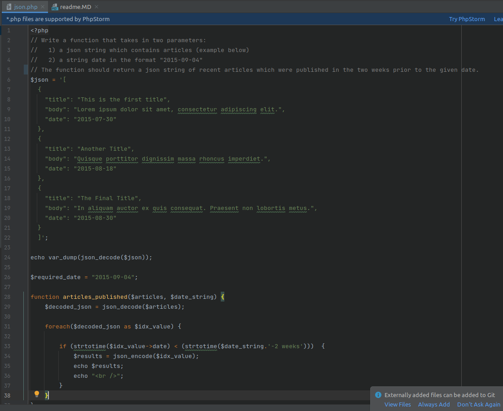
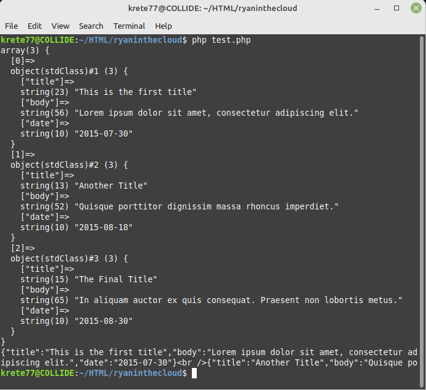

# Take home assessment for Randy Reilly

### Write a function that takes in two parameters:
   1) A json string which contains articles (example below)
   2) A string date in the format "2015-09-04"
   3) The function should return a json string of recent articles which
      were published in the two weeks prior to the given date. 

Note:  Feel free to run your code as many times as needed for debugging.

$json = '[
  { 
    "title": "This is the first title", 
    "body": "Lorem ipsum dolor sit amet, consectetur adipiscing elit.",
    "date": "2015-07-30"
  },
  {
    "title": "Another Title",
    "body": "Quisque porttitor dignissim massa rhoncus imperdiet.",
    "date": "2015-08-18"
  },
  {
    "title": "The Final Title",
    "body": "In aliquam auctor ex quis consequat. Praesent non lobortis metus.",
    "date": "2015-08-30"
  }
  ]';

  
Screenshot  of code (source is available above in text format as well)

Screenshot of results (last 3 lines have date results, first chunk is var_dump of array)

